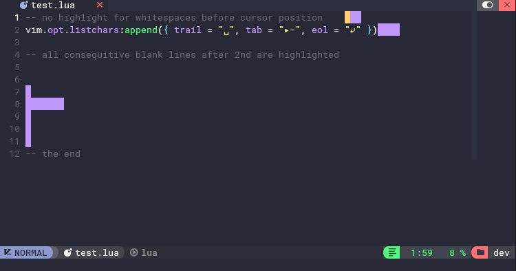

# `ws-trim.nvim`

[](https://github.com/aanatoly/ws-trim.nvim/releases)
[](./LICENSE)
[][neovim]


[Neovim][neovim] plugin for highlighting trailing whitespace and extra blank lines.

**Features:**

- Highlights whitespace in all normal buffers, including `gitcommit` buffers.
- Highlights the following types of whitespace issues:
  - Trailing spaces at the end of a line.
  - Excessive consecutive blank lines (more than `max_blank_lines`).
- Whitespace before the cursor on the current line is not highlighted.
- Highlights are **window-local**, and automatically re-applied when switching
  buffers or splits — works correctly in multiple windows.

**Notes**

- Only normal buffers (`buftype == ""`) are affected.
- Plugin does not remove whitespace — it only highlights it.
  Formatting is left to LSP or [conform]



## Installation

Using [`lazy.nvim`](https://github.com/folke/lazy.nvim):

```lua
{
  "aanatoly/ws-hl.nvim",
  event = { "FileType" },
  opts = {},
}
```

## Configuration

The default configuration is

```lua
opts = {
  -- maximum number of consecutive blank lines allowed
  -- extra lines beyond this limit are highlighted
  max_blank_lines = 2,

  -- highlight group for trailing whitespace and extra blank lines
  -- see `h: nvim_set_hl` for details
  -- { link = "Error" } - link to Error hl_group
  -- { bg = "red" } - red background
  hl_ws_group = { link = "Error" },
}
```

Example usage

```lua
opts = {
  max_blank_lines = 1,
  hl_ws_group = { bg = "yellow" },
}
```

[neovim]: https://neovim.io/
[conform]: https://github.com/stevearc/conform.nvim
